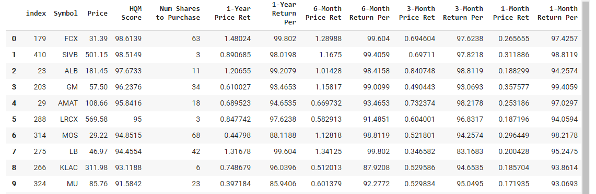

# quantitative-momentum

## Description

Quantitative-momentum is a Jupyter notebook that investigates the fundamentals of momentum investing--a trading strategy in which investors buy stocks that are rising and ideally sell them at their peaks. In this study, I selected 50 S&P 500 constituents with the highest price momentum and calculated the recommended number of shares to purchase based on an equally weighted portfolio. I utilized [IEX Cloud APIs](https://iexcloud.io/docs/api/) to attain sandbox test financial data. As a result, the data used in this notebook is not real (but still somewhat similar).

The general process for the notebook was:

1. Import Necessary Packages
2. Attain S&P Stock Listings
3. Batch API Calls
4. Data Analysis
5. 50 S&P 500 Stocks with the Highest Price Momentum
6. Momentum Strategy
7. High-Quality-Momentum Score
8. Number of Shares to Purchase

## Usage

Every detailed step was recorded in the notebook and can easily be followed there.

## Examples

